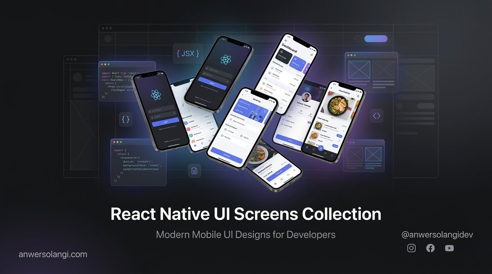

<p align="center">
  
</p>

<br />

<p align="center">
  <a href="https://github.com/anwersolangi/rn-interface-kit/stargazers">
    
  </a>
  <a href="https://github.com/anwersolangidev/rn-interface-kit/forks">
    
  </a>
  
  
  
</p>

<br />

<h1 align="center">rn-interface-kit</h1>

<p align="center">
  A curated collection of premium React Native UI screens — production-ready, single-file components built with Expo. Each screen is crafted for visual impact, clean code, and real-world usability.
</p>

<br />

---

## ✦ What's Inside

Every screen in this repo is:

- **Single-file** — one `.tsx` per screen, no scattered files
- **Zero-comment** — clean, readable code that speaks for itself
- **Expo-ready** — works out of the box with Expo Router
- **TypeScript-first** — fully typed, production-grade patterns
- **Animation-focused** — built with Reanimated, Skia, Gesture Handler

---

## ✦ Tech Stack

| Library | Purpose |
|---|---|
| `react-native-reanimated` | Physics-based & declarative animations |
| `react-native-gesture-handler` | Touch & gesture interactions |
| `@shopify/react-native-skia` | Canvas-based 2D graphics |
| `expo-blur` | Glassmorphism / blur effects |
| `expo-linear-gradient` | Gradient overlays & backgrounds |
| `expo-haptics` | Tactile feedback |
| `expo-vector-icons` | Icon system |
| `react-native-svg` | SVG rendering |

---

## ✦ Getting Started

### 1. Clone the repo

```bash
git clone https://github.com/anwersolangidev/rn-interface-kit.git
cd rn-interface-kit
```

### 2. Install dependencies

```bash
npm install
# or
yarn install
```

### 3. Start the dev server

```bash
npx expo start
```

### 4. Run on device

Scan the QR code with **Expo Go** on iOS or Android, or press `i` / `a` to open a simulator.

---

## ✦ Repo Structure

```
rn-interface-kit/
├── assets/
│   └── cover.png
├── app/
│   ├── index.tsx                      # Entry / screen list
│   └── (stack)/
│       ├── neo-brutalism-wallet.tsx   # Neo-brutalism wallet UI
│       ├── food-ordering.tsx          # Food ordering app UI
│       ├── kids-scenery.tsx           # Animated landscape scene
│       ├── travel-booking.tsx         # Flight, bus & train booking UI
│       ├── settings-toggle.tsx        # Dark/light mode settings screen
│       ├── duolingo-drag-drop.tsx     # Drag & drop translation UI
│       ├── cyberpunk-slot-machine.tsx # Cyberpunk slot machine
│       ├── broadcast-radio.tsx        # Interactive broadcast radio UI
│       ├── pizza-ordering.tsx         # Interactive pizza ordering UI
│       ├── flappy-bird.tsx            # Flappy Bird game UI
│       └── ...                        # More screens added regularly
└── README.md
```

> Each screen is independently runnable — copy any `.tsx` into your own Expo Router project and it works.

---

## ✦ Screens

> 🎬 Video demos on my social channels — links below.

| Screen | Key Feature |
|---|---|
| Neo Brutalism Wallet | Bold borders, raw typography, stark contrast |
| Food Ordering App | Menu UI, cart interactions, smooth gestures |
| Animated Landscape Scene | Skia canvas, sky gradient, sun & river motion |
| Travel Booking (Flight / Bus / Train) | Tab switching, seat selection, booking flow |
| Settings + Dark/Light Toggle | Satisfying animated mode switch |
| Dashboard UI | Visual hierarchy, card layouts, data display |
| Duolingo Drag & Drop | Gesture-based translation interaction |
| Cyberpunk Slot Machine | Reel animation, neon aesthetics, win states |
| Broadcast Radio UI | Tuner dial, waveform animation, station list |
| Pizza Ordering UI | Topping selector, animated pizza builder |
| Flappy Bird | Game loop, physics, collision detection |
| And many more... | New screens added every week |

---

## ✦ Contributing

PRs are welcome.

1. Fork the repo
2. Create a branch: `git checkout -b feat/your-screen-name`
3. Add your single-file screen inside `app/(stack)/`
4. Open a pull request

Keep to the code standards — single file, no comments, TypeScript, Expo-compatible.

---

## ✦ License

MIT — free to use in personal and commercial projects. Attribution appreciated but not required.

---

## ✦ Support My Work

If this repo saves you time, consider supporting on Patreon — it keeps new screens coming 🚀

<p align="center">
  <a href="https://patreon.com/anwersolangidev">
    
  </a>
</p>

---

## ✦ Hire Me

> Open to freelance projects, UI consulting, and mobile app collaboration.

<p align="center">
  <a href="https://anwersolangi.com">
    
  </a>
  &nbsp;
  <a href="mailto:me@anwersolangi.com">
    
  </a>
  &nbsp;
  <a href="https://wa.me/923212325161">
    
  </a>
</p>

---

## ✦ Follow Along

Every screen gets recorded as a short-form video — speed builds, breakdowns, and deep dives.

<p align="center">
  <a href="https://youtube.com/@anwersolangidev">
    
  </a>
  &nbsp;
  <a href="https://instagram.com/anwersolangidev">
    
  </a>
  &nbsp;
  <a href="https://tiktok.com/@anwersolangidev">
    
  </a>
  &nbsp;
  <a href="https://x.com/anwersolangidev">
    
  </a>
</p>

<br />

<p align="center">
  Made with ❤️ by <a href="https://anwersolangi.com"><strong>Anwer Solangi</strong></a>
</p>