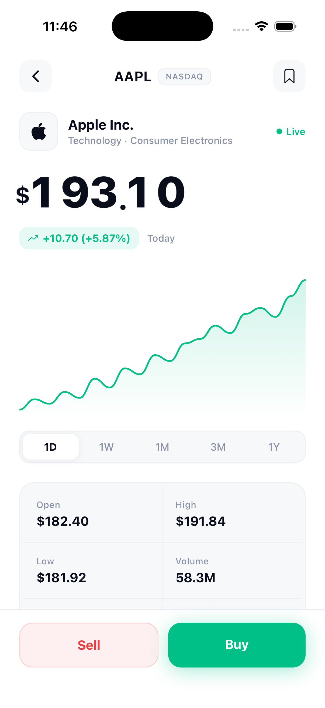
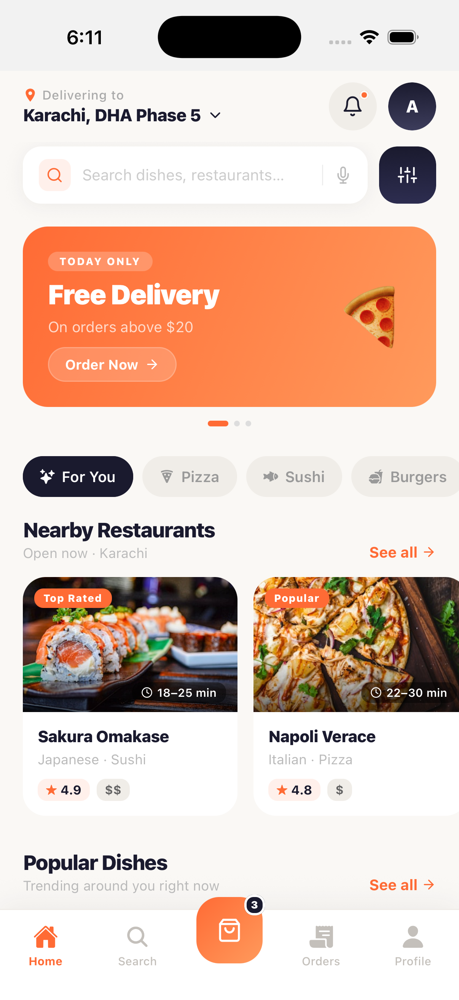
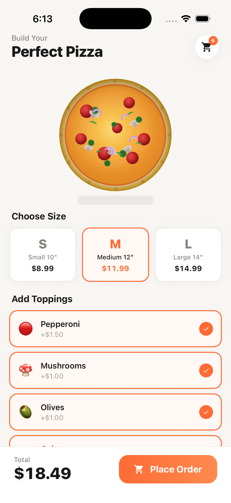
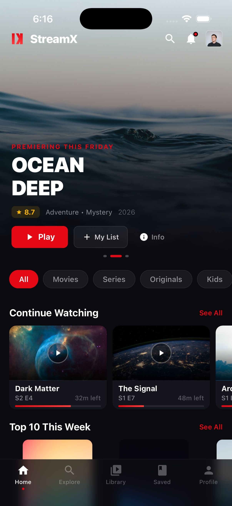
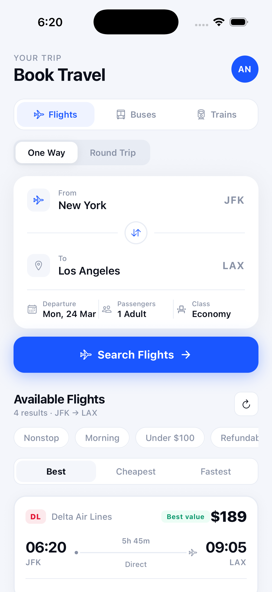

<p align="center">
  
</p>

<br />

<p align="center">
  <a href="https://github.com/anwersolangi/rn-interface-kit/stargazers">
    
  </a>
  <a href="https://github.com/anwersolangi/rn-interface-kit/forks">
    
  </a>
  
  
  
</p>

<br />

<h1 align="center">rn-interface-kit</h1>

<p align="center">
  A curated collection of premium React Native UI screens — production-ready, single-file components built with Expo. Each screen is crafted for visual impact, clean code, and real-world usability.
</p>

<br />

---

## ✦ Gallery 

Get a glimpse of the premium interfaces included in this kit. *(More views added regularly!)*

<p align="center">
  
  
  
</p>

<p align="center">
  
  
  
</p>

---

## ✦ Screens Included
- Food Ordering UI
- Travel Booking
- Spotify Wrap
- Stock Digit Flip Animation
- Cyberpunk Slot Machine
- Duolingo Drag & Drop
- Broadcast Radio
- Pizza Ordering
- Flappy Bird
And many more...

---

## ✦ What's Inside

Every screen in this repo is:

- **Single-file** — one `.tsx` per screen, no scattered files
- **Zero-comment** — clean, readable code that speaks for itself
- **Expo-ready** — works out of the box with Expo Router
- **TypeScript-first** — fully typed, production-grade patterns
- **Animation-focused** — built with Reanimated, Skia, Gesture Handler

---

## ✦ Tech Stack

| Library | Purpose |
|---|---|
| `react-native-reanimated` | Physics-based & declarative animations |
| `react-native-gesture-handler` | Touch & gesture interactions |
| `@shopify/react-native-skia` | Canvas-based 2D graphics |
| `expo-blur` | Glassmorphism / blur effects |
| `expo-linear-gradient` | Gradient overlays & backgrounds |
| `expo-haptics` | Tactile feedback |
| `expo-vector-icons` | Icon system |
| `react-native-svg` | SVG rendering |

---

## ✦ Getting Started

### 1. Clone the repo

```bash
git clone [https://github.com/anwersolangi/rn-interface-kit.git](https://github.com/anwersolangi/rn-interface-kit.git)
cd rn-interface-kit